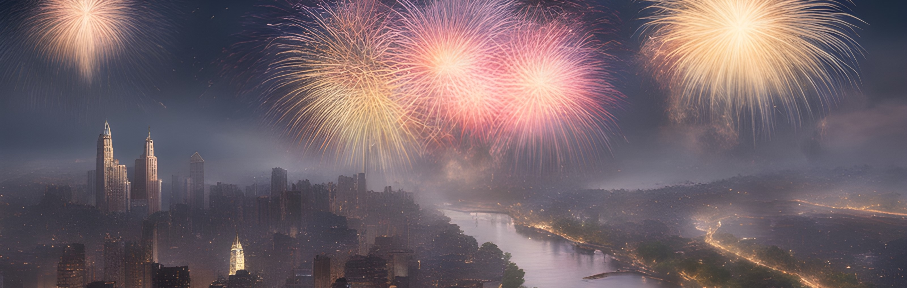

# Silvester ambience sensor

### LoRaWAN sensor measuring light and sound levels

Attempt to measure impact of pyrotechnics on light and sound levels during New Year's Eve

[Introduction](#introduction) • [Functionality](#functionality) • [Data](#data) • [Dependencies](#dependencies) • [License](#license)

## Introduction
During New Year's Eve, the air is polluted by - undoubtedly beautiful - fireworks, and other forms of pyrotechnics, and measurements show that it takes several hours or even days until the air quality reaches the same level as before. 
Another problem is the light and sound pollution, which is stressful specially for animals, but also for elderly people, children, or other people with special needs.
This project is an attempt to measure the impact of pyrotechnics on light and sound levels during New Year's Eve, and to raise awareness about the problem.

## Functionality

## Data

## Dependencies

## License
